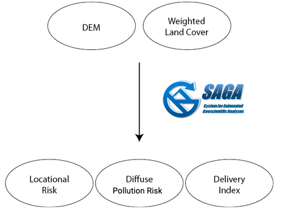
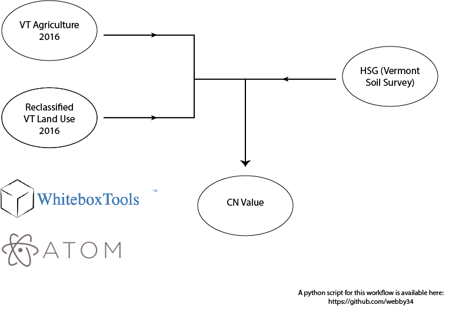

# Modeling Runoff in the New Haven River Watershed

The purpose of this project is to provide conservationists and local policymakers a tool to identify and target potential high risk runoff areas. I created this app as part of my independent senior research as a Conservation Biology major with a strong interest in GIS. It is my hope that this work may be used mitigate the effects of non-point source pollution in the New Haven River Watershed. I have spent countless hours exploring, fishing, and swimming in the New Haven River and would love nothing more than to contribute towards the protection of this river for future generations to enjoy in a similar fashion. I can be reached for questions, comments, and suggestions at webby@middlebury.edu.

__The app can be found [here](https://webby.users.earthengine.app/view/newhavenrunoff)__

## Instructions for Using the App

Layers can be selected/deselected using the checkboxes on the right side panel. By default, the diffuse pollution risk layer is displayed over a hillshade layer. This allows the viewer to see high risk pollution areas and understand the topography of the region. The opacity of layers can be adjusted by using the sider that appears once a layer has been selected. 

#### Runoff Models
The SCIMAP risk mapping model produces two intermediate layers and a final Diffuse Pollution Risk layer.

First, the SAGA tool calculates a locational risk, which is the likelihood that a given point can generate risk of pollution ([Milledge et al., 2012](https://www.sciencedirect.com/science/article/pii/S004896971200873X), [Nsibirwa, 2018](https://ukzn-dspace.ukzn.ac.za/handle/10413/17276)).

The model also produces a delivery index, which is an indicator of hydrologic connectivity: high risk areas in red represent areas that are highly connected to the hydrologic flows of the watershed meaning pollution in these areas are likely to enter the river.

The final and most important layer is Diffuse Pollution Risk. This puts the two intermediate layers together, and indicates which areas are high risk for contributing diffuse pollution to a water body.

The app also contains an SCS Curve Number layer which is a mathematical model created by the USDA. This method predicts approximate runoff given a certain rain event, as a function of land use and hydrologic soil group. Hydrologic soil group is based on soil's runoff potential (A being the lowest and D the highest). A value of 100 indicates zero infiltration and 100% runoff, while a value of zero indicates 100% infiltration. More information can be found [here](https://engineering.purdue.edu/mapserve/LTHIA7/documentation/scs.htm#:~:text=The%20SCS%20curve%20number%20method,find%20average%20annual%20runoff%20values.)

## Methods

#### Diffuse Pollution Risk

For this model, data was preprocessed in WhiteboxTools and QGIS. The model itself was done using SAGA, an open source GIS software. The Diffuse Pollution Risk tool takes a DEM and weighted land cover map and identify areas of risk based on land cover, hydrologic connectivity, TPI, and slope. Land cover types with higher weights are those more likely to contribute to diffuse pollution, such as agriculture. For this model I used land cover weights based on a study by [Perks et al., 2017](https://pubmed.ncbi.nlm.nih.gov/28185700/). More information about the Diffuse pollution risk tool in SAGA can be found [here](https://saga-gis.sourceforge.io/saga_tool_doc/8.1.1/sim_hydrology_4.html).

To run this model you will need a DEM and a weighted landcover raster. Land cover classes can be reclassified into desired weights before running the tools. An optional precipiation raster can be included: if not the tool will run assuming uniform precipiation across the basin. In order to run the tool all layers must be resampled to have the same spatial resolution and extent. 

#### SCS Curve Number

This layer was created using Whitebox Tools. The python script for this work can be found [here](https://github.com/webby34/newHavenRunoff). To run this script you will need a raster landcover dataset and a raster layer containing hydrologic soil group data. The script can be edited to reflect different land use/HSG combinations. 

#### Water Quality Sampling
In an effort to assess the validity of the model, I sampled water quality in the field. I sampled water from four sites: Where the Muddy Branch enters the New Haven, Eagle Park, Lincoln, and up in the headwaters of the New Haven by the Emily Proctor trailhead. I sampled for both turbidity and phosphorous levels. This process is still ongoing and will be updated as I collect and analyze more data. 

## Datasets
The following datasets were used in this project:
- [VT Hydrography Dataset High Resolution NHD](https://geodata.vermont.gov/documents/VCGI::vt-hydrography-dataset-high-resolution-nhd/about)
- [VT Subwatershed Boundaries](https://geodata.vermont.gov/datasets/VCGI::vt-subwatershed-boundaries-huc12/explore?location=43.870450%2C-72.459750%2C8.41)
- [VT NRCS Soil Survey Units](https://geodata.vermont.gov/datasets/VCGI::vt-data-nrcs-soil-survey-units/explore?location=43.875000%2C-72.470000%2C8.41)
- [VT Land Cover 2016](https://geodata.vermont.gov/pages/land-cover)
- [VT Agriculture 2016](https://geodata.vermont.gov/pages/land-cover)
- [VT USGS National Elevation Dataset DEM 10m](https://geodata.vermont.gov/documents/3caf2e5280fe489bb62c3bc5234c4e3e/explore)
- [VT Town Boundaries](https://geodata.vermont.gov/datasets/VCGI::vt-data-town-boundaries-1/explore)

## References and Resources

The following references were used throughout this project. Many of these sources provide case studies and application of the SCIMAP risk mapping (SAGA Diffuse Pollution Risk) framework or SCS methods.

- [Al-Juaidi, 2018: A simplified GIS-based SCS-CN method for the assessment of land-use change on runoff](https://www.researchgate.net/publication/325571714_A_simplified_GIS-based_SCS-CN_method_for_the_assessment_of_land-use_change_on_runoff)
- [Barenblitt and Fatoyinbo, 2020: Creating GEE Apps, NASA Applied Remote Sensing Training Program](https://appliedsciences.nasa.gov/sites/default/files/2020-10/Part3App_Final.pdf)

- [Milledge et al., 2012: A Monte Carlo approach to the inverse problem of diffuse pollution risk in agricultural catchments](https://www.sciencedirect.com/science/article/pii/S004896971200873X)

- [New Haven River – 2016 and 2017 Water Quality Summary](https://acrpc.org/wp-content/uploads/2021/03/2017-New-Haven-River.pdf)

- [Nsibirwa, 2018: AN ASSESSMENT OF THE CRITICAL SOURCE AREAS AND TRANSPORT PATHWAYS OF DIFFUSE POLLUTION IN THE UMNGENI CATCHMENT, SOUTH AFRICA](https://ukzn-dspace.ukzn.ac.za/handle/10413/17276)

- [Perks et al., 2017: Use of spatially distributed time-integrated sediment sampling networks and distributed fine sediment modeling to inform catchment management](https://pubmed.ncbi.nlm.nih.gov/28185700/)

- [Purdue Engineering SCS Method](https://engineering.purdue.edu/mapserve/LTHIA7/documentation/scs.htm#:~:text=The%20SCS%20curve%20number%20method,find%20average%20annual%20runoff%20values.)

 - [Richardson et al., 2019: Muddying the Picture? Forecasting Particulate Sources and Dispersal Patterns in Managed Catchments](https://www.frontiersin.org/articles/10.3389/feart.2019.00277/full)

- [Vojtek and Vojteková, 2016: GIS-BASED APPROACH TO ESTIMATE SURFACE RUNOFF IN SMALL CATCHMENTS: A CASE STUDY](https://sciendo.com/article/10.1515/quageo-2016-0030)

